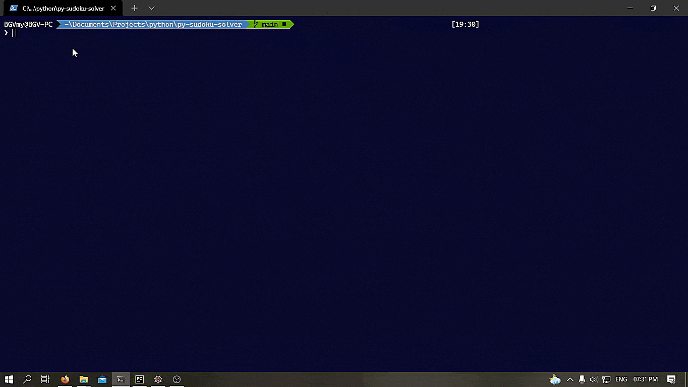

# Python Sudoku Solver

This is a python program that solves a given sudoku puzzle. 
The application takes in a path for an input text file which contains the sudoku puzzle as comma separated numbers with 
blank spot represented by '#'. Thr application displays the solution for that puzzle if it exists and presents an option
to save that solution to a file. The example for the input text file and its corresponding solution can be seen in the 
files provided in the `example_puzzle/` directory. The demonstration of this application can be seen in the following gif.

## Code Quality

To analyze the quality of code, pylint was run on this project for all python files.
Pylint rating of this project was *`8.32/10`*. The detailed output of pylint analysis can be found [here](misc/pylint_log.txt).

## Project Organization

| Name | Type | Description |
|------|------|-------------|
|`run.py`|Python file| This file is the entrypoint for application. This file should be run to start the application. |
|`sudoku.py`|Python file| This file contains all the classes and functions for working of this application.|
|`test_sudoku.py`|Python file| This is a pytest unit test file containing unit tests for methods used in this application.|
|`README.md`|Markdown file| The readme of this repo.|
|`example_puzzles`|Directory| This directory example sudoku puzzles and their solution to illustrate how the input and output of this application is formatted.|
|`misc`|Directory| This directory contains additional files like pylint log and image files etc.|
|`puzzle.txt`|Text file|This is a sudoku puzzle formatted as comma separated values of numbers and blank spot represented by '#' and also each column is represented as a newline. This file is used to quickly test and use the application.| 

